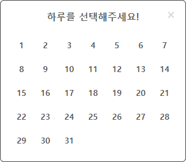

# Zaritalk Calendar

Date picker components that allows you to select a day or date range.
It comes with two components and utility functions to help you with date manipulation.

- RangePicker
- DayPicker
- date utils

[Storybook](https://640efcd05a191d88bc939551-wqitemnddj.chromatic.com/)

## Screenshots


<br/>



## Installation

```bash
To be added
```

## Usage

```
To be added
```

## Options

```
To be added
```

## Date Utilities

```
To be added
```
