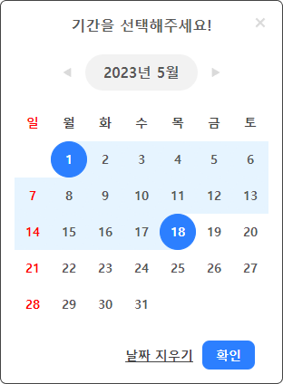
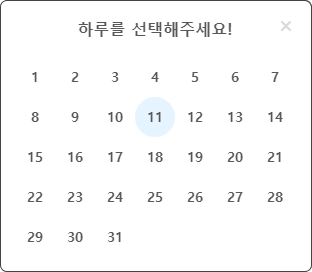

# sp-date-picker

Date picker components that allows you to select a day or date range.
It comes with two components and utility functions to help you with date manipulation.

- RangePicker
- DayPicker
- date utils

[Storybook](https://6411a222f5925f939069a362-cqueebvdjx.chromatic.com/?path=/story/demo--demo)

## Screenshots



<br/>



## Demo Video

https://user-images.githubusercontent.com/53928959/225493481-6937f8c1-c5db-429d-b05f-932cbf9e5e9c.mp4

## Installation

```bash
npm install sp-date-picker
```

## Usage

### DatePicker

```javascript
import { DatePicker, getYearMonthDate, useDatePicker } from 'sp-date-picker'

// 1. Use the hook provided
const datePicker = useDatePicker()

// 2. Extract what you need from the hook
const { handleOpen, startDate, endDate } = datePicker

// 3. Create handlers that open/close the date picker
const handleDatePickerOpen = useCallback(() => {
  handleOpen(true)
}, [handleOpen])
const handleDatePickerClose = useCallback(() => {
  handleOpen(false)
}, [handleOpen])

// ...

return (
  // 4. Pass the value returned from the hook to the date picker
  // 5. Don't forget to pass the onCloseClick handler
  <DatePicker {...datePicker} onCloseClick={handleDatePickerClose} />
)
```

### DayPicker

```javascript
// 1. Use the hook provided
const dayPicker = useDayPicker()

// 2. Extract what you need from the hook
const { selectedDay, handleOpen } = dayPicker

// 3. Create handlers that open/close the date picker
const handleDayPickerOpen = useCallback(() => {
  handleOpen(true)
}, [handleOpen])
const handleDayPickerClose = useCallback(() => {
  handleOpen(false)
}, [handleOpen])

// ...

// 4. Pass the value returned from the hook to the date picker
// 5. Don't forget to pass the onCloseClick handler
return <DayPicker {...dayPicker} onCloseClick={handleDayPickerClose} />
```

## Example

An example of date picker using styled-components

<details>
<summary>Example</summary>

```javascript
const Box = styled.div`
  padding: 0 15px;
  display: flex;
  flex-direction: column;
  gap: 15px;

  figure figcaption h1 {
    font-size: 1.25rem;
    font-weight: 700;
    margin-bottom: 0.5rem;
    color: #444;
    padding-top: 15px;
  }

  .datepicker__input-box {
    display: flex;
    flex-direction: row;
    gap: 10px;
  }

  .demo__input {
    border: 1px solid #dadada;
    width: 250px;
    padding: 10px;
    cursor: text;
    border-radius: 4px;

    &::placeholder {
      color: 1px solid #b5b5b5;
    }
  }

  hr {
    border: 0;
    border-top: 1px solid #dadada;
    margin: 0;
  }
`

function App() {
  const datePicker = useDatePicker()
  // Extract what we need from the hook
  const { handleOpen, startDate, endDate } = datePicker
  // Create handlers that open/close the date picker
  const handleDatePickerOpen = useCallback(() => {
    handleOpen(true)
  }, [handleOpen])
  const handleDatePickerClose = useCallback(() => {
    handleOpen(false)
  }, [handleOpen])

  // Additionally, we can format the date strings
  const startDateString = useMemo(() => {
    return startDate ? getYearMonthDate(startDate) : ''
  }, [startDate])
  const endDateString = useMemo(() => {
    return endDate ? getYearMonthDate(endDate) : ''
  }, [endDate])

  return (
    <Box>
      <figure>
        <figcaption>
          <h1>Date Picker</h1>
        </figcaption>
        <div className="datepicker__input-box">
          <input
            type="text"
            className="demo__input"
            readOnly
            placeholder="Start Date"
            value={startDateString}
            onClick={handleDatePickerOpen}
          />
          <input
            type="text"
            className="demo__input"
            readOnly
            placeholder="End Date"
            value={endDateString}
            onClick={handleDatePickerOpen}
          />
          <DatePicker
            {...datePicker}
            onCloseClick={handleDatePickerClose}
            isRange
            id="demo"
          />
        </div>
      </figure>
    </Box>
  )
}
```

</details>

## Custom Styling

If you are willing to customize the styling of the date picker, you can use the `id` prop to pass in your own class name.

_In the code_

```javascript
<DatePicker
  {...datePicker}
  onCloseClick={handleDatePickerClose}
  isRange
  // Pass in your own id to customize the styling
  // This is needed to make higer specificity
  id="demo"
/>
```

_In the css_

```css
#demo .datepicker__day.selected {
  background-color: purple;
  border-color: purple;
}

#demo .datepicker__day-box:has(.selected) {
  background-color: purple;
}

#demo .datepicker__day-box:has(.between) {
  background-color: purple;
}
```

Target the `id` you passed in to the date picker and select the element you want to customize. **You can see what selector you are looking for by inspecting the element in the browser.**

Here are few examples of css selectors you can use to customize the styling.

| Selector                                                                  |
| ------------------------------------------------------------------------- |
| .datepicker\_\_day.selected                                               |
| .datepicker\_\_day-box:has(.selected)                                     |
| .datepicker\_\_day-box:has(.between)                                      |
| .datepicker\_\_day:hover                                                  |
| .datepicker\_\_month.selected                                             |
| .datepicker\_\_footer\_\_clear-date-button.datepicker\_\_footer\_\_button |
| .datepicker\_\_footer\_\_confirm-button.datepicker\_\_footer\_\_button    |

Try including the below css in your project to see how it looks like.

**Custom Style**


**CSS**

```css
#demo .datepicker__footer__clear-date-button.datepicker__footer__button span {
  color: gray;
}

#demo .datepicker__footer__confirm-button.datepicker__footer__button {
  background-color: #ffac2c;
}

#demo .datepicker__day.selected {
  background-color: #ffac2c;
  border-color: #ffac2c;
}

#demo .datepicker__day-box:has(.selected) {
  background-color: #fff1e6;
}

#demo .datepicker__day-box:has(.between) {
  background-color: #fff1e6;
}
```

## Options

There are the props you might be interested in.

### DatePicker

| Option                  | Required           | Description                                          | Default           | Type                                  |
| ----------------------- | ------------------ | ---------------------------------------------------- | ----------------- | ------------------------------------- |
| title                   |                    | Title of the date picker                             | Pick dates range! | string                                |
| date                    | <center>o</center> | Currently selected date (used on day picker)         |                   | Date                                  |
| startDate               | <center>o</center> | Currently selected start date (used on range picker) |                   | Date                                  |
| endDate                 | <center>o</center> | Currently selected end date (used on range picker)   |                   | Date                                  |
| open                    | <center>o</center> | Whether the date picker is open or not               | false             | boolean                               |
| onConfirmClick          | <center>o</center> | Clled when confirm button is clicked                 |                   | ({ date, startDate, endDate}) => void |
| onCloseClick            | <center>o</center> | Called when close button is clicked                  |                   | () => void                            |
| onBackdropClick         |                    | Called when backdrop is clicked                      |                   | () => void                            |
| isRange                 |                    | Whether the date picker is a range picker or not     | true              | boolean                               |
| disablePast             |                    | Whether to disable past dates when start date is set | false             | boolean                               |
| style                   |                    | CSS styles to be applied to the date picker          |                   | CSSProperties                         |
| customSelectMonthMotion |                    | Motion to be applied to the month selection          |                   | AnimationProps (framer-motion)        |
| customSelectDayMotion   |                    | Motion to be applied to the day selection            |                   | AnimationProps (framer-motion)        |

### DayPicker

| Option          | Required           | Description                                  | Default             | Type                           |
| --------------- | ------------------ | -------------------------------------------- | ------------------- | ------------------------------ |
| title           |                    | Title of the date picker                     | Pick a day!         | string                         |
| selectedDay     | <center>o</center> | Currently selected day                       | <center>-1</center> | number                         |
| open            | <center>o</center> | Whether the date picker is open or not       | false               | boolean                        |
| onDayClick      | <center>o</center> | Called when a day is clicked                 |                     | (day: number) => void          |
| onCloseClick    | <center>o</center> | Called when close button is clicked          |                     | () => void                     |
| onBackdropClick |                    | Called when backdrop is clicked              |                     | () => void                     |
| style           |                    | CSS styles to be applied to the date picker  |                     | CSSProperties                  |
| customMotion    |                    | Motion to be applied to the picker container |                     | AnimationProps (framer-motion) |

Most of props are given by the hook provided. Use javascript deconstruction to extract what you need. See the example below.

```javascript
// DatePicker - range picker
const datePicker = useDatePicker()
const { startDate, endDate } = datePicker

// DatePicker - day picker
const datePicker = useDatePicker()
const { date } = datePicker

// DayPicker
const datePicker = useDayPicker()
const { selectedDay } = datePicker
```

Extract handlers to create open/close handlers.

```javascript
const datePicker = useDayPicker()
const { handleOpen } = datePicker

const handleDatePickerOpen = useCallback(() => {
  handleOpen(true)
}, [handleOpen])

const handleDatePickerClose = useCallback(() => {
  handleOpen(false)
}, [handleOpen])
```

## Date Utilities

| Function           | Description                                                             |
| ------------------ | ----------------------------------------------------------------------- |
| `getEmptyDays`     | Returns the number of empty days in a month prior to the very first day |
| `getTotalDays`     | Returns the total number of days in a month                             |
| `getDayNames`      | Returns an array of day names in default locale                         |
| `getFirstSunday`   | Returns the day that is the first Sunday of the month                   |
| `isSunday`         | Check if a date is a Sunday                                             |
| `isSaturday`       | Check if a date is a Saturday                                           |
| `isWeekend`        | Check if a date is a weekend (Saturday or Sunday)                       |
| `getYearMonthDate` | Get a date format of YYYY-MM-DD                                         |
| `getYearMonth`     | Get a date format of YYYY-MM                                            |
| `getYear`          | Get a date format of YYYY                                               |
| `getMonth`         | Get a date format of MM                                                 |
| `getDate`          | Get a date format of DD                                                 |

## Todo

- [x] Fix failing tests
- [ ] ~~Add more tests if needed~~
